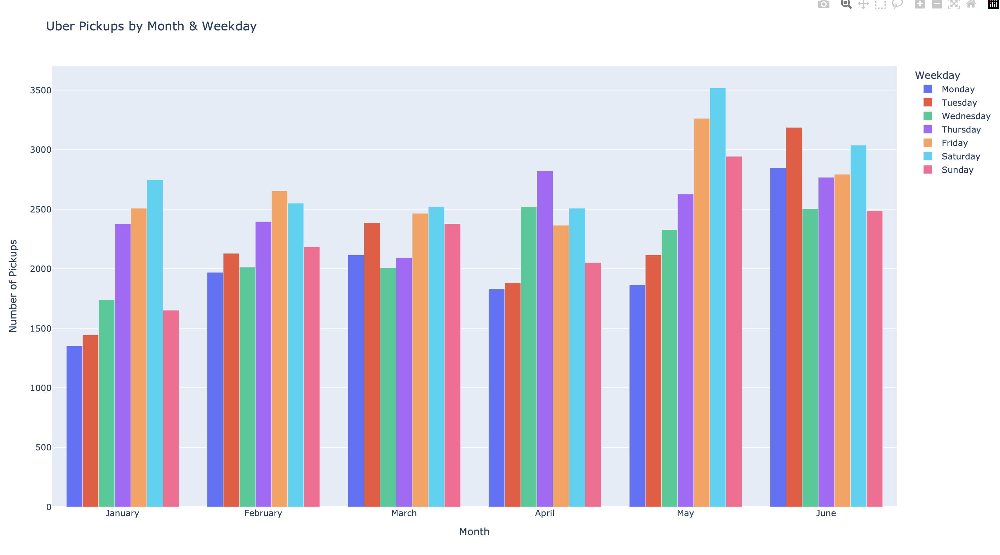
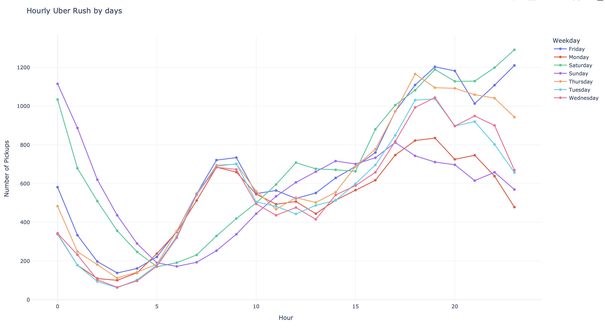
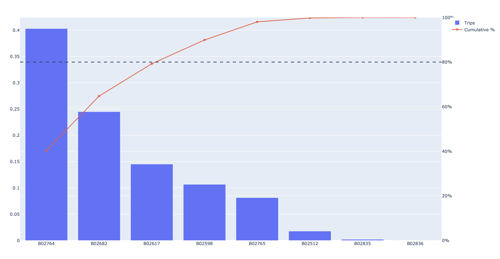
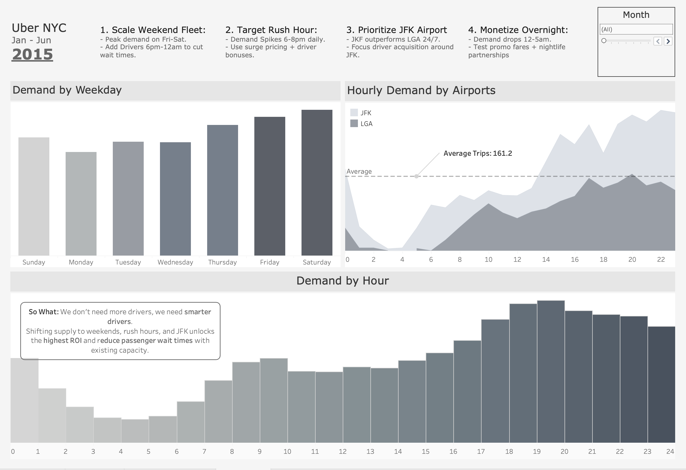

🚗 Uber NYC 2015 — Demand Analysis & Operations Dashboard
Jan–Jun 2015 | Python · Pandas · Plotly · Tableau

📌 Overview
Analysis of Uber pickup data from New York City to uncover demand patterns and turn them into real operational recommendations. Covers weekday behavior, hourly rush windows, dispatching base performance, and airport demand — wrapped into a Tableau dashboard with strategic insights.

⚙️ Tech Stack
Python · Pandas · Plotly · Matplotlib · Tableau

🔍 What Was Done

Cleaned and deduplicated raw pickup data
Extracted time features: month, weekday, hour, minute
Analyzed demand by weekday, hour, and month
Pareto analysis on dispatching bases (80/20 rule)
Compared airport demand: JFK vs LGA vs EWR
Built interactive charts with Plotly
Exported clean data → Tableau dashboard

📊 Visualizations

📈 Tableau Dashboard
🔗 [View Dashboard Here](https://public.tableau.com/app/profile/breno.zamponi/viz/UberNYCReport/UberReport?publish=yes)

💡 Key Insights & Recommendations
#ActionWhy🚀Scale Weekend FleetFri–Sat peak demand — add drivers 6pm–12am⚡Target Rush HourDemand spikes 6–8pm daily — surge pricing + bonuses✈️Prioritize JFKJFK outperforms LGA 24/7 — focus driver acquisition there🌙Monetize Overnight12–5am is underused — test promo fares + nightlife deals

💬 Bottom line: We don't need more drivers — we need smarter drivers.
Shifting supply to weekends, rush hours, and JFK delivers the highest ROI with existing capacity.

👤 Author
Breno Larocerie Zamponi — Data Analytics · BI · ML

[LinkedIn](https://www.linkedin.com/in/breno-zamponi-b3bb2a2aa/?skipRedirect=true)
